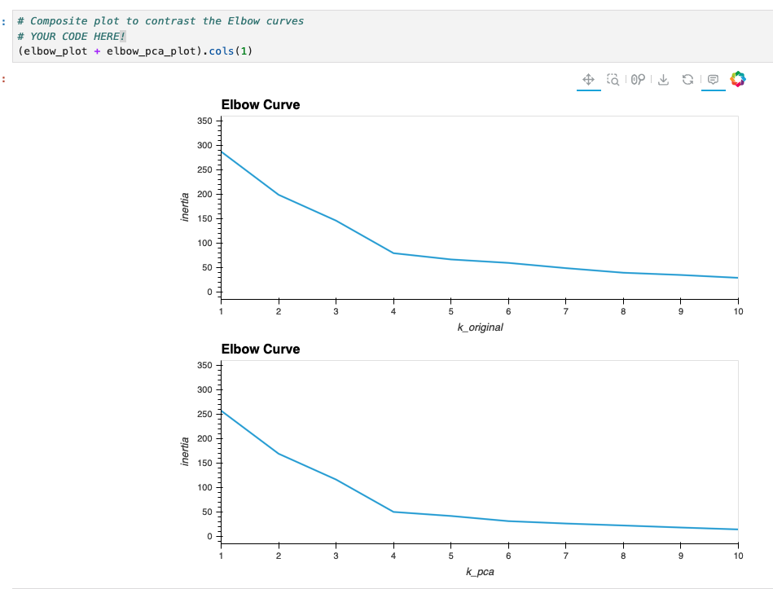
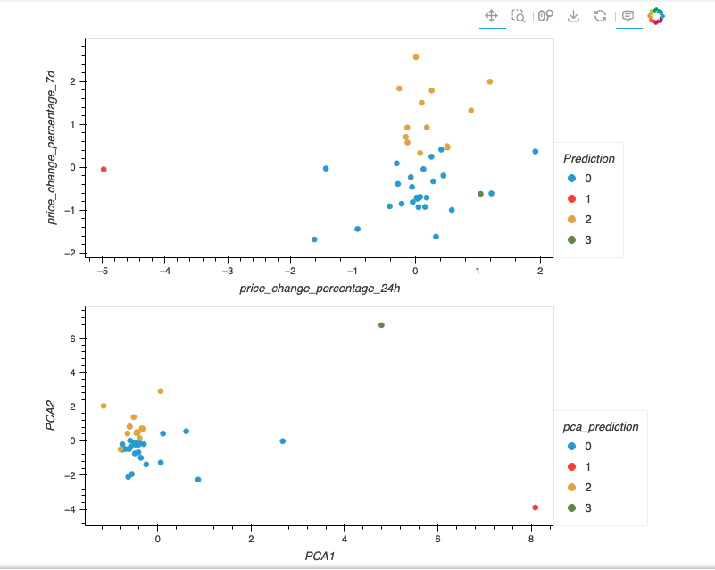
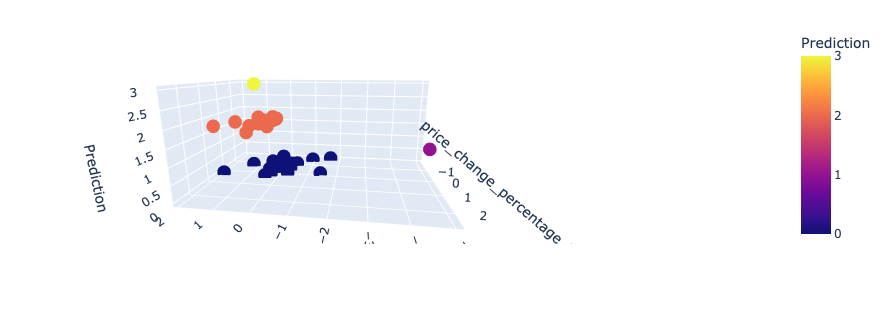

### Clustering Cryptocurrencies with Machine Learning (Challenge 19)

This repository hosts a mini-project where a K-means model was utilized to cluster various cryptocurrencies.

### Analysis Overview
This repository demonstrates the use of an unsupervised Machine Learning model to cluster cryptocurrencies. The goal was to identify the optimal way to cluster these assets and to assess how inertia and the number of features influence the analysis.

The data preparation process was followed by two rounds of analysis using the following steps:
- Creating a Pandas DataFrame with the data for analysis.
- Determining the optimal 'k' value.
- Applying the K-means clustering algorithm using Sci-kit Learn.
- Visualizing the results with hvPlot.

This process was repeated twice using different datasets: the original dataset and an optimized version processed through Principal Component Analysis (PCA).

### Q&A Summary
The Jupyter Notebook in this repository answers these key questions during the analysis:

1. **What is the best value for k?**  
   - **Answer:** 4 (original dataset).

2. **What is the total explained variance of the three principal components?**  
   - **Answer:** Approximately 89.50% (original dataset).

3. **What is the best value for k when using the PCA-processed data?**  
   - **Answer:** 4 (dataset after PCA).

4. **Does this differ from the best k value found using the original data?**  
   - **Answer:** No, it remains the same (dataset after PCA).

5. **What is the impact of using fewer features for clustering in K-Means after PCA?**  
   - **Answer:** The inertia decreased, and the data points appeared more tightly grouped. Using fewer features reduced ambiguity, leading to clearer results.

### Repository Contents
- **Resources folder**: Contains the CSV file used for the analysis.
- **Crypto_Clustering.ipynb Jupyter Notebook**: Includes the Python code for the analysis, with detailed comments to facilitate understanding.

- 
- 
- 
